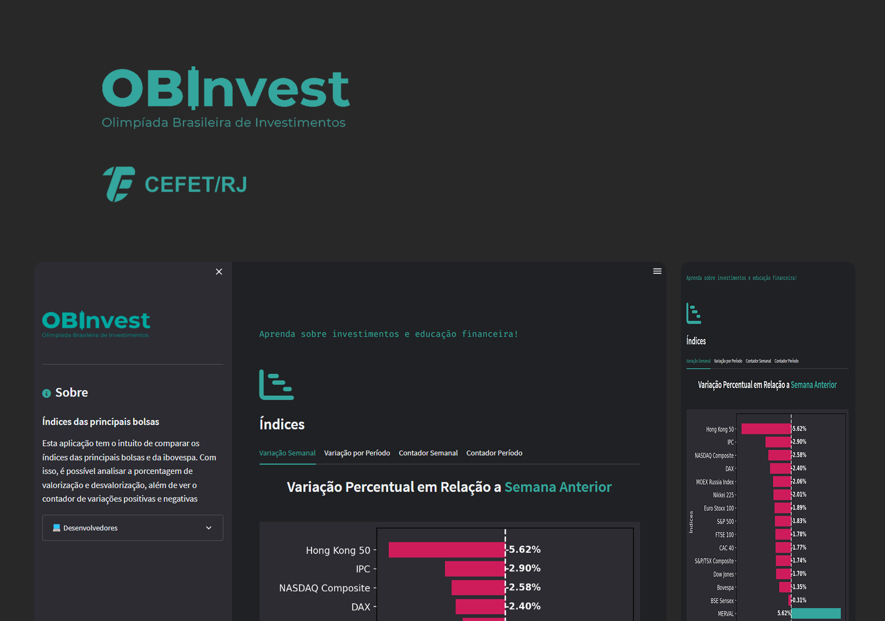
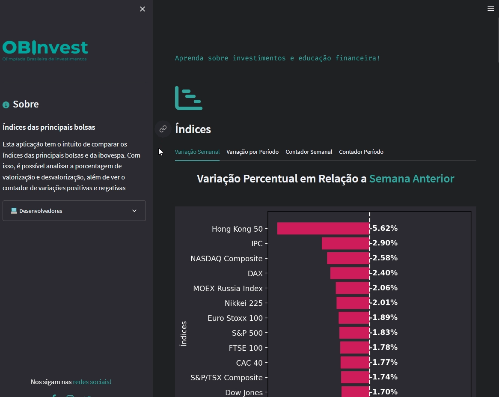
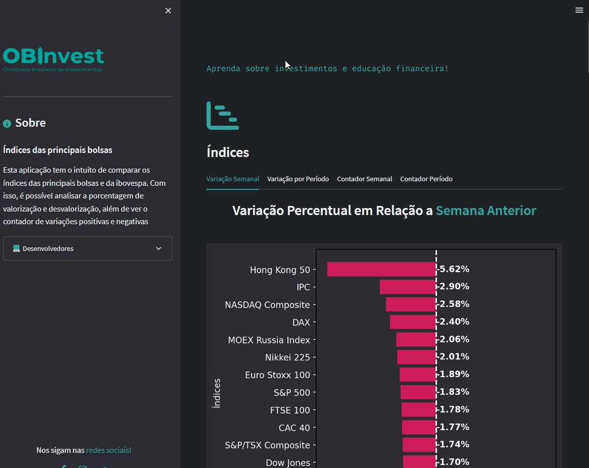
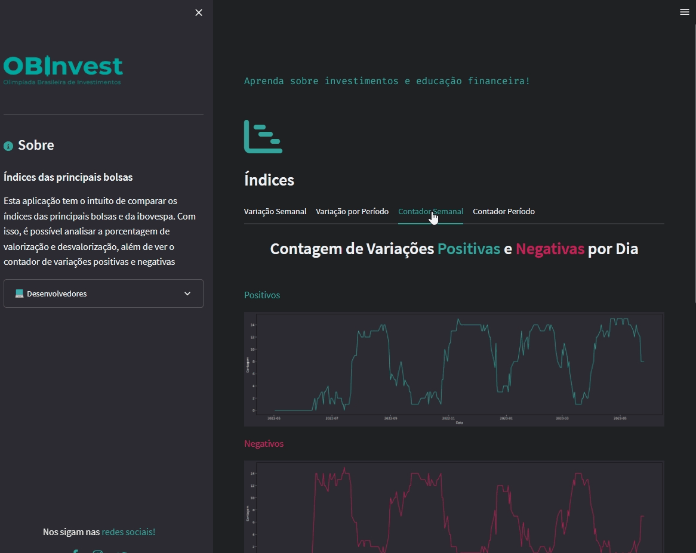

<h1 align="center">
    
</h1>

<div align="center">
    <h3> 📉 Aprenda sobre investimentos e educação financeira! 📈 </h3>
    <a href="https://obinvest.org/" target="_blank">
      
    </a>
    <a href="https://github.com/PedroCantanhede" target="_blank">
      
    </a>
     
    
    
</div>

# Índices

Esta aplicação tem o intuito de comparar os índices das principais bolsas e da ibovespa. Com isso, é possível analisar a porcentagem de valorização e desvalorização, além de ver o contador de variações positivas e negativas.

<p align="center">
  
</p>

# 🔨 Tecnologias

💻 React

💻 TypeScript

💻 Python

💻 Streamlit

💻 Matplotlib

💻 yFinance

💻 Datetime

💻 HTML / CSS

## :camera: Veja:

### Aplicação Desktop






### Código:


## :rocket: Dependências

```bash
# Instale as dependências do streamlit
$ pip install streamlit

# Instale as dependências do matplotlib
$ python -m pip install -U pip
$ python -m pip install -U matplotlib

# Instale as dependências do yfinance
$ pip install yfinance

# Abra o projeto rodando ele
$ streamlit run app.py

```

## :infinity: Ajuda do Professor Gilberto Gil

A ajuda do professor durante as aulas na faculdade foram essenciais para que nós chegássemos no final do projeto. Deixamos nossos agradecimentos ao professor **Gilberto Gil Passos**.
[Venha e participe da comunidade da OBInvest!!!](https://obinvest.org/)
